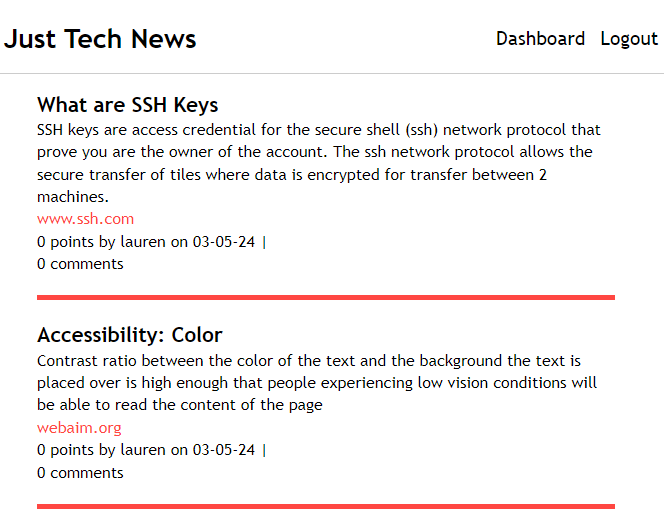
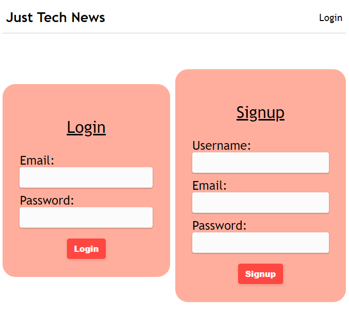
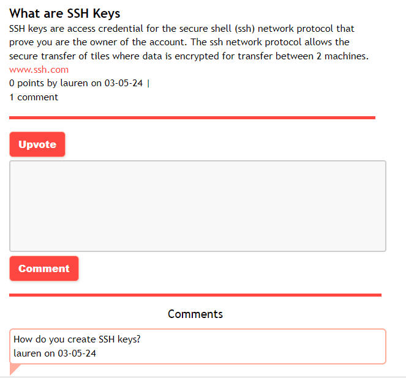
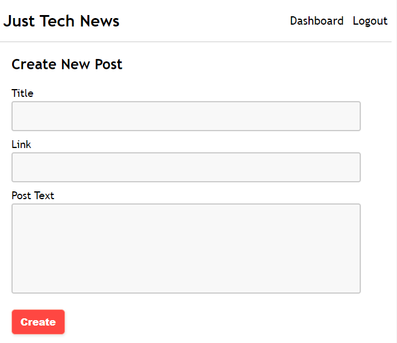
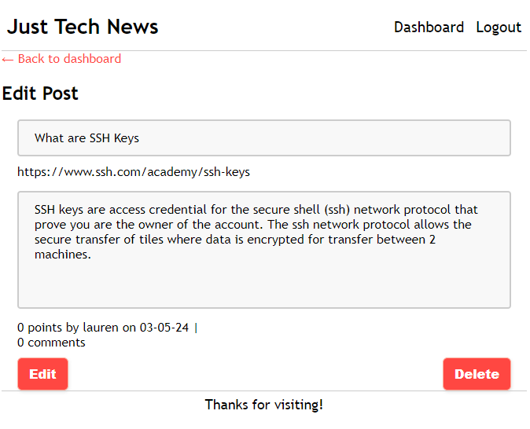

# Java-Tech_API

# Overview

Blog site created in order to learn how to use Java to write back-end and Thymeleaf on the front-end. Users are able to view posts from other users. Once they create an account they are able to maintain their posts through their dashboard and comment on other posts.

## Table of Contents

- [Installation](#installation)
- [Usage](#usage)
- [License](#license)
- [Contributing](#contributing)

## Installation

In order to run the application you will need Java installed on your computer. Then fork the repository and build the application. I'm currently running it in [IntelliJ IDEA Community](https://www.jetbrains.com/idea/download/). This is a free Integrated Development Environment (IDE) for Java and Kotlin.

Technology Used:
 * Java
 * SQL
 * Spring Boot
 * Bcrypt
 * Maven
 * Thymeleaf
 * JavaScript
 * CSS
 * HTML

## License

This project is licensed under the MIT license.

## Usage

On load the homepage will be visible. Click on an individual post to see the comments for the post. Click on the link for the post be redirected to the website linked to the blog post. Create an account and login to see your dashboard. From the dashboard you can create a new post and see all of your old posts. Click edit on a post to change the information or delete the post. 

## Contributing

MSU Full Stack Bootcamp continuing education tutorials

## HomePage

## Login

## Individual Post

## Create Post

## Edit Post

